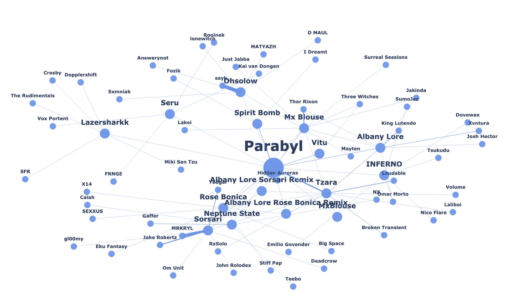

# CollabMap


*CollabMap for [Parabyl](https://open.spotify.com/artist/6RhLS4l1XlQMBME2Ox0t2D) (depth = 3)*

## Summary 

When two artists collaborate together on a song, they are making an implicit agreement that their styles overlap in some way, or at least that they enjoy each other's music enough to be willing to work together on a song. CollabMap takes this basic unit of a collaboration, and attempts to systematize the relationship between artists based on who they have collaborated with. Beyond being a tool to generate data useful for research of the music industry, this tool can also help you discover new music by answering a series of simple question: who does your favourite artist collaborate with the most? And who do those artist collaborate with the most? And so on.

CollabMap is a Python project which generates graphs whose nodes are artists, and whose edges represent the number of times those two artists have collaborated together. Data is collected using the Spotify API. Requests are cached into the `data` directory to limit the number of API calls. NetworkX and Plotly are used to generate the graph and represent it visually.

In terms of the project's structure, the main file is `collabmap.py`, which is invoked with command-line arguments. See usage section below. `collabdict.py` and `collabgraph.py` contain classes for the dictionary, graph and plot used by `collabmap.py`, as well as some other helper functions related to making API calls and managing access tokens.

## Installation 

### Clone and install dependencies

```console
emilio@MBP:~$ git clone https://github.com/emilioziniades/collabmap
emilio@MBP:~$ cd collabmap
emilio@MBP:~$ pip install -r requirements.txt

```

### Obtain Spotify API keys and store in `.env` file

`collabmap.py` reads the API client ID and secret from a file named `.env` in the project's root directory. To obtain this, you need to visit [Spotify for Developers](https://developer.spotify.com/), select 'Dashboard', log in and select 'Create an App'. Follow the instructions there, and copy-paste the client ID and client secret into `.env` with the following variable names:

```
CLIENT_ID=abc123...
CLIENT_SECRET=def456...
```

## Usage

After following the instructions above, you should be able to run `collabmap.py`. It is used as follows,

```
python collabmap.py [-h] [--depth D] [--save] artist
```

To view all the arguments and their purpose,
```console
emilio@MBP:~$ python collabmap.py -h
```

Graphs not saved by default, and depth defaults to 3. Please note that the number of artists to parse grows exponentially as you increase the depth. Anything beyond depth = 4 will take a very long time.

A typical request would look like this,

```console
emilio@MBP:~$ python collabmap.py --depth 4 Madlib
```

Please note that an artist whose name is multiple words should be enclosed by quotation marks. For example,

```console
emilio@MBP:~$ python collabmap.py "Earl Sweatshirt"
```

It is mandatory to specify an artist's name.

The process may take some time, especially if you have picked a depth > 3, or if you have selected an artist with a larger discography. Sometimes Spotify's rate-limits kick in, but since the query responses are cached, you can simply execute the same command again and it should pick up where it left off.

Once the process is done, a browser window should open with the graph of collaborations. The thicker the edges, the more collaborations between those two artists. It is also possible to save the graph as a png image using the `--save` or `-S` switches.

## Next Steps

This project was initially part of my journey to learn Python. I had a lot of fun doing it, but it is certainly nowhere near complete. Here are a few features that I may implement if I have some free time in the future.

- [ ] Create a simple front-end site with a search box that displays the graphs and provides the option to save the graphs as images.
- [ ] Tweak the visual appearance of the graphs, either by improving the positioning algorithm or by simply changing colours and label settings.
- [ ] Provide the option to prune graphs and keep only edges between nodes which have 2 or more collaborations.


## Collaboration

Anyone is welcome to contribute to this project. If you have an idea for a feature, or notice a bug, open up an issue. If you want to implement some feature or fix a bug yourself, create a pull request.
